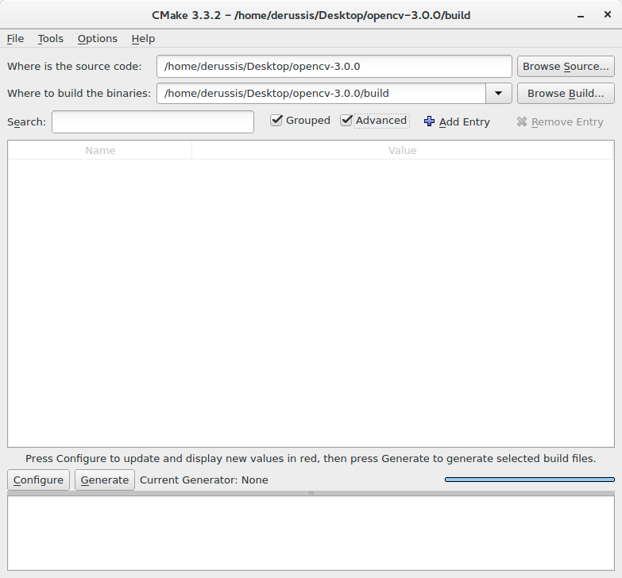

==========================
Java için OpenCV Kurulumu
==========================

Java için OpenCV'ye Giriş
--------------------------------
OpenCV 2.4.4 versiyonundan itibaren Java ile uygulama geliştirmeyi desteklemektedir. Bu eğitim, OpenCV'yi masaüstü işletim sisteminize kurmanıza yardımcı olacaktır.

En güncel Java versiyonunu yükleyin
--------------------------------
En güncel Java JDK'yı 'Oracle <http://www.oracle.com/technetwork/java/javase/downloads/index.html> `_ web sitesinden indirin. İndirdiğiniz dosyayı açarak son Java JDK'sını kurmanız gerekir.

En güncel Eclipse versiyonunu yükleyin
-----------------------------------
En son Eclipse sürümünü Eclipse sayfasından indirin  `Eclipse indirme sayfası <https://www.eclipse.org/downloads/eclipse-packages/>`_  ``Eclipse IDE for Java Developers`` dağıtımını seçin (önerilen).

İndirilen sıkıştırılmış dosyayı çıkartın ve klasörü istediğiniz dizine koyun. Herhangi bir şey yüklemenize gerek yok, Eclipse kurulumsuz olarak da çalışabilir. Alternatif olarak, Eclipse yükleyicisini deneyebilirsiniz.

Windows için OpenCV 3.x yüklemek
------------------------------------
Öncelikle OpenCV kütüphanesini (sürüm 3.x) indirmeniz gerekir. `buradan <http://opencv.org/releases.html>`_.

Ardından, indirdiğiniz OpenCV dosyasını seçtiğiniz bir yerde çıkarın.

İhtiyacınız olacak dosyalar şunlardır:  ``opencv-3xx.jar`` bulunduğu dizin ``\opencv\build\java`` ve ``opencv_java3xx.dll`` bulunduğu dizin  ``\opencv\build\java\x64`` (64-bit sistem için) veya ``\opencv\build\java\x86`` (32-bit sistem içşn). Her dosyanın `3xx` sonekini geçerli OpenCV sürümü için bir kısayol olarak düşünün, örnek; `300`  OpenCV 3.0 ve `330`  OpenCV 3.3 sürümünü ifade eder. 

MacOS için OpenCV 3.x yüklemek
---------------------------------
MacOS altında OpenCV'yi elde etmenin en hızlı yolu `Homebrew <http://brew.sh>`_. Homebrew'i kurduktan sonra, `XCode Komut Satırı Araçları'nın 'sisteminize önceden yüklenmiş olup olmadığını kontrol etmeniz gerekir.

Bunu yapmak için 'Terminal'i açın ve çalıştırın:
``xcode-select --install``
Mac OS bu araçları yüklemek isterse, indirme ve yükleme işlemine devam edin. Aksi halde, OpenCV kurulumuyla devam edin.

Bir önkoşul olarak Apache Ant'ın yüklü olup olmadığını kontrol edin. Aksi takdirde, Homebrew ile kurun:
``brew install ant``.
Ant bu dizinde mevcut olmalı ``/usr/local/bin/ant``.

Homebrew aracılığıyla OpenCV'yi (Java desteğiyle) kurmak için, Homebrew'de * opencv * ekini düzenlemeniz gerekir:
``brew edit opencv``
Açılacak metin düzenleyicisinde, satırı değiştirin:
``-DBUILD_opencv_java=OFF``
yerine
``-DBUILD_opencv_java=ON``
daha sonra, dosyayı kaydedin artık OpenCV'yi etkili bir şekilde kurabilirsiniz:
``brew install --build-from-source opencv``

OpenCV yüklendikten sonra gerekli jar dosyası ve dylib kütüphanesi şu adreste bulunacaktır: ``/usr/local/mesutpiskin/opencv/3.x.x/share/OpenCV/java/``, örnek., ``/usr/local/mesutpiskin/opencv/3.3.1/share/OpenCV/java/``.

Dikkat, OpenCV'yi önceki bir sürümden yükselterek kurarsanız bu yöntemin çalışmayabileceğini unutmayın: OpenCV'yi kaldırmanız ve yeniden kurmanız gerekir.

Linux için OpenCV 3.x yüklemek
---------------------------------
Lütfen unutmayın: Aşağıdaki talimatlar, OpenCV'yi Windows veya MacOS altında derlemek isterseniz kullanışlıdır. Linux paket yönetim sistemleri (`apt-get`,` yum`, vb.) * OpenCV kütüphanesinin gerekli sürümünü sağlayabilir.
İlk adım olarak, `CMake <http://www.cmake.org/download/>`_ ve `Apache Ant <http://ant.apache.org/>`_, indirip kurun. OpenCV kütüphanesini indirin `opencv <http://opencv.org/releases.html>`_.
İndirdiğiniz OpenCV dosyasını istediğiniz dizine çıkartın ve CMake'i açın (cmake-gui).
Çıkarılan OpenCV dosyaları (örn. / Opencv/) dizinindedir ve "binary dosyalar " ise /opencv/build dizininde olacaktır.
Sonunda, "Gruplanmış" ve "Gelişmiş" onaylarını kontrol edin.

Şimdi `` Configure`` düğmesine basın ve `` Unix Makefiles`` için varsayılan derleyicileri kullanın. Lütfen, bir C / C ++ derleyicisi yüklediğinizden emin olun.
`` Ungrouped Entries`` grubuna, Apache Ant çalıştırılabilir dosyasına (örn. "/ Apache-ant-1.9.6 / bin / ant") yol ekleyin.
"BUILD" grubunda seçimi kaldırın:

* ``BUILD_PERF_TESTS``
* ``BUILD_SHARED_LIBRARY`` Java bağları dinamik kütüphaneyi tamamen yeterli hale getirir
* ``BUILD_TESTS``
* ``BUILD_opencv_python``

`` CMAKE`` grubunda, `` CMAKE_BUILD_TYPE`` `` Debug`` (veya `` Release``) olarak ayarlayın

``JAVA`` grubu:

* Java AWT include yolunu ekleyin (örnek, ``/usr/lib/jvm/java-1.8.0/include/``)
* Java AWT kütüphane yolunu ekleyin (örnek., ``/usr/lib/jvm/java-1.8.0/include/jawt.h``)
* Java include yolunu ekle (örnek, ``/usr/lib/jvm/java-1.8.0/include/``)
* alternatif Java  yolunu ekleyin (örnek, ``/usr/lib/jvm/java-1.8.0/include/linux``)
* JVM kütüphane yolunu ekleyin (örnek, ``/usr/lib/jvm/java-1.8.0/include/jni.h``)

"Configure" a iki kez basın ve CMake penceresi beyaz bir arka planla görünmelidir. Değilse, kırmızı çizgileri düzeltip tekrar `` Configure '' düğmesine basın. Şimdi, `` Generate '' e basın ve CMake'i kapatın.
.. image:: _static/01 - 01.png

Şimdi terminali açın, OpenCV'nin `` build`` klasörüne gidin ve her şeyi `` make -j`` komutu ile derleyin. `-j` parametresi, izin verilen maksimum iş parçacıkları sayısıyla paralel olarak çalıştırılmasını sağlar, bu da yapıyı teorik olarak daha hızlı hale getirir. Şimdi sürecin tamamlanmasını bekleyin...
Her şey yolunda giderse, `` / opencv / build / bin`` dizininde `` opencv-3xx.jar`` ve `` / opencv / build / lib`` dizininde `` libopencv_java3xx.so`` olmalıdır. . Her dosyanın '3xx' soneki, geçerli OpenCV sürümü için bir kısayoltur, örneğin, OpenCV 3.0 için '300' ve OpenCV 3.3 için '330' olacaktır. İhtiyacınız olan her şey budur.

Eclipse'de Java için OpenCV Kurma
----------------------------------
Eclipse'i açın ve istediğiniz çalışma alanını seçin. Bir sonraki projelerinizde kullanılmaya hazır bir Kullanıcı Kütüphanesi oluşturun:  ``Window > Preferences...``.

.. image:: _static/01 - 02.png

Menünün altından gidin ``Java > Build Path > User Libraries`` and choose ``New...``.
Kitaplık için bir ad girin (ör. Opencv) ve yeni oluşturulan kullanıcı kitaplığını seçin.
Seçin ``Add External JARs...``, browse to select ``opencv-3xx.jar`` bilgisayardan seçin.
Jar'ı ekledikten sonra, seçimi genişletin ``Native library location`` and press ``Edit...``.

.. image:: _static/01 - 03.png

Seçin ``External Folder...`` ve OpenCV kütüphanesini içeren klasörü seçmek için göz atın (örnek, ``C:\opencv\build\java\x64``).

MacOS için, * Homebrew olmadan OpenCV * yüklediyseniz, .so dosyası için .dylib uzantılı  bir bağlantı oluşturmanız gerekir. Örneğin, terminalden şunu yazın:
``ln -s libopencv_java300.so libopencv_java300.dylib``

Diğer IDE'ler için OpenCV Kurulumu
---------------------------------------------------
IntelliJ kullanıyorsanız, kütüphanein konumunu VM parametresi olarak vermeniz gerekir `` -Djava.library.path = /opencv build/lib`` ile belirtebilirsiniz.
