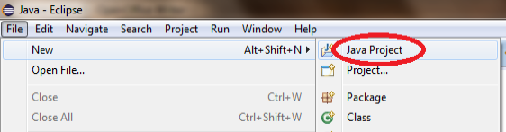
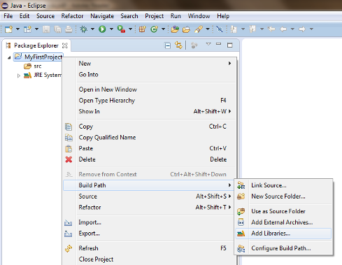
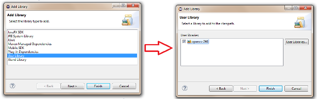
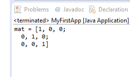

=======================================
OpenCV ile ilk Java Uygulaması
=======================================

.. note:: Şimdiye kadar önceki bölümü okuduğunuzu düşünüyorum. Eğer okumadıysanız şu adresten okuyabilirsiniz. `<http://opencv-java-tutorials.readthedocs.org/en/latest/index.html>`_. Kaynak kodlar için ise şu bağlantıyı kullanabilirsiniz `<https://github.com/opencv-java/>`_

OpenCV ile Java Uygulaması
------------------------------
Bu ders, Eclipse'de OpenCV kütüphanesini kullanarak basit bir Java konsolu uygulaması oluşturulması sürecinde size rehberlik eder.

Bu derste ne yapacağız
--------------------------------
Bu derste şunları yapacağız:
  * Yeni bir Java Projesi oluşturmak
  * Projeye bir Kullanıcı Kütüphanesi eklemek
  * Bazı OpenCV kodunu yazmak
  * Uygulamayı kurmak ve çalıştırmak

Yeni Proje Oluşturun
--------------------
Eclipse'i açın ve yeni proje oluşturun; ``File`` menü, ``New`` ve  ``Java Project``.

``New Java Project`` projenizin adını yazın ve ``Finish``.

Yeni Kullanıcı Kütüphanesi Ekleme
---------------------------------
Önceki dersin ardından (``Java için OpenCV'yi Yükleme``)  zaten OpenCV kütüphanesini ayarlamış olmalısınız; Değilse lütfen önceki derse göz atınız.
Artık kütüphaneyi projenize eklemeye hazırsınız.
Eclipse de ``Package Explorer`` proje üzerinde sağ tuş ``Build Path --> Add Libraries...``.

Seçiniz ``User Libraries`` ve ``Next``, OpenCV kütüphanesinin onay kutusunu işaretleyin ve tıklayın ``Finish``.

Basit bir uygulama oluşturma
---------------------------
Projenize sağ tıklayın ve bir sınıf oluşturun ``New --> Class``.
Hem paket hem de sınıf için seçtiğiniz bir ad yazın ve sonra bitiri tıklayın. ``Finish``.
Şimdi ilk uygulamanızın kodunu yazmaya hazırız.
``main`` method tanımlayarak başlayalım:

.. code-block:: java

    public class HelloCV {
	    public static void main(String[] args){
		    System.loadLibrary(Core.NATIVE_LIBRARY_NAME);
		    Mat mat = Mat.eye(3, 3, CvType.CV_8UC1);
		    System.out.println("mat = " + mat.dump());
	    }
    }

Öncelikle projemizde daha önce belirlenmiş olan OpenCV  Kütüphanesini yüklemeliyiz.

.. code-block:: java

    System.loadLibrary(Core.NATIVE_LIBRARY_NAME);

Sonra yeni bir Mat tanımlayabiliriz.

.. note:: ** Mat ** sınıfı, n-boyutlu yoğun sayısal tek kanallı veya çok kanallı bir diziyi temsil eder. Gerçek veya karmaşık değerli vektörleri ve matrisleri, gri tonlamalı veya renkli görüntüleri, vektör alanları, nokta bulutları, tensörler, histogramları depolamak için kullanılabilir. Daha fazla bilgi için OpenCV'yi inceleyin. `sayfa <http://docs.opencv.org/3.0.0/dc/d84/group__core__basic.html>`_.

.. code-block:: java

    Mat mat = Mat.eye(3, 3, CvType.CV_8UC1);

` Mat.eye`` bir kimlik matrisini temsil eder, boyutlarını (3x3) ve elemanlarının türünü belirleriz.

Fark edeceğiniz gibi, kodu şu şekilde bırakırsanız bir hata alırsınız; Bunun nedeni, bazı değişkenlerin çözülememesi gerçeğidir. Fare imlecinizi hatalar gibi görünen sözcüklerin üzerine getirebilir ve bir diyalogun açılmasını bekleyip "İçe Aktarma..." seçeneğini tıklayın. Bunu koda aşağıdaki satırları eklediğiniz tüm değişkenler için yaparsanız:
.. code-block:: java

    import org.opencv.core.Core;
    import org.opencv.core.CvType;
    import org.opencv.core.Mat;

Şimdi Çalıştır düğmesini tıklayarak uygulamanızı oluşturup çalıştırabiliriz.
Aşağıdaki çıktıyı almayı bekliyoruz:

Kaynak kodu şu adreste mevcuttur:`GitHub <https://github.com/opencv-java/getting-started/blob/master/HelloCV/>`_.
