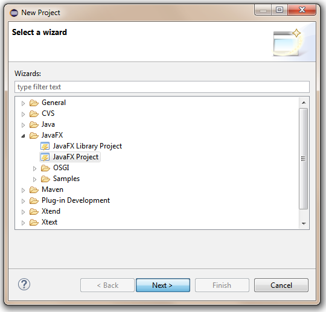
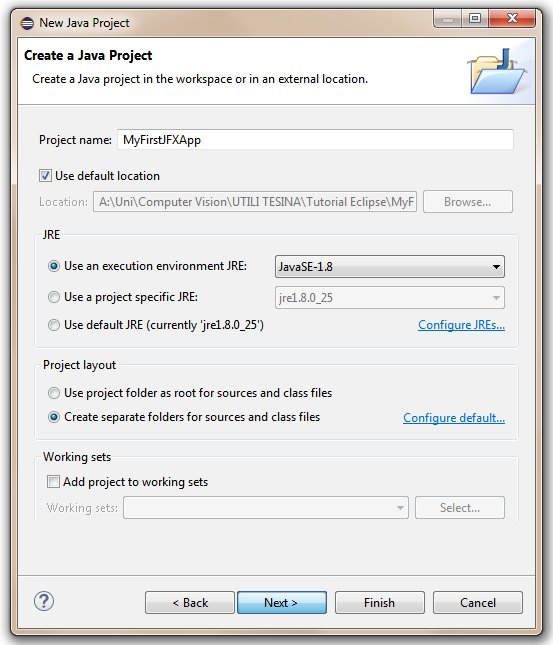
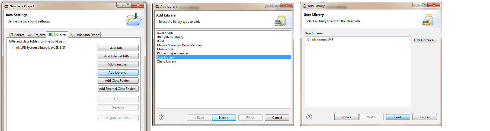
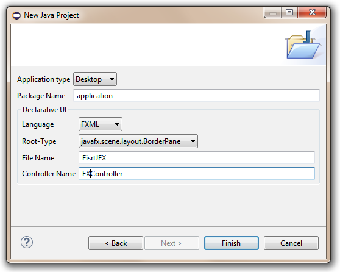
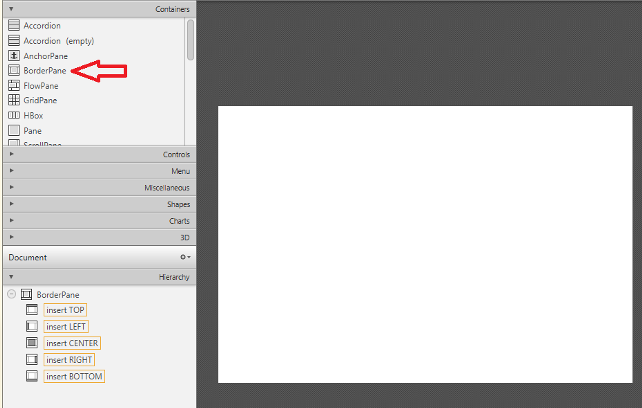
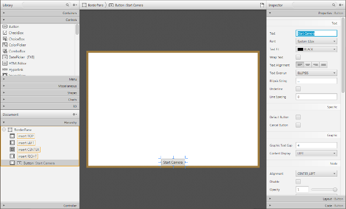
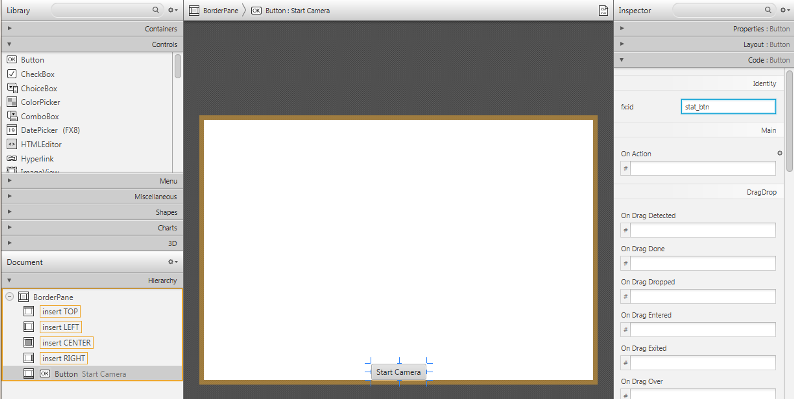
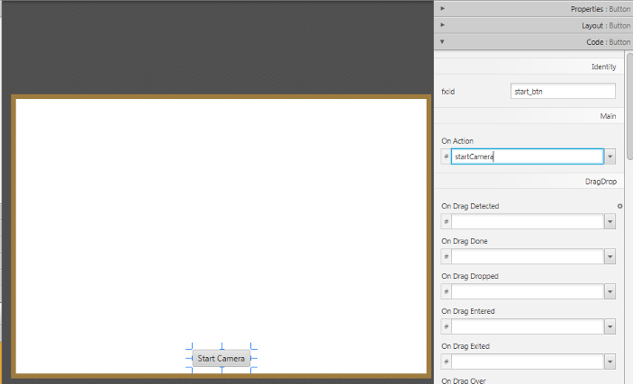
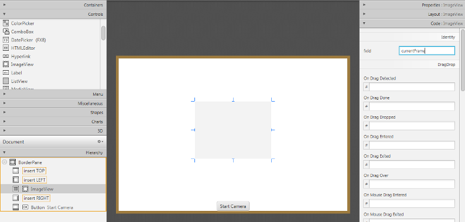
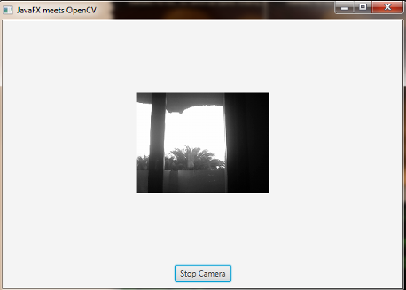

=========================================
JavaFX ile İlk OpenCV Uygulaması
=========================================

.. note:: Şimdiye kadar önceki bölümü okuduğunuzu düşünüyorum. Eğer okumadıysanız şu adresten okuyabilirsiniz. `<http://opencv-java-tutorials.readthedocs.org/en/latest/index.html>`_. Kaynak kodlar için ise şu bağlantıyı kullanabilirsiniz `<https://github.com/opencv-java/>`_

JavaFX ile bir OpenCV uygulaması
--------------------------------
Bu eğitimde, Eclipse'de OpenCV kütüphanesini kullanarak basit bir JavaFX GUI uygulaması oluşturulması konusunda size yol göstereceğiz.

Bu öğreticide ne yapacağız
--------------------------
Bu kılavuzda şunları yapacağız:
  * ``E(fx)clipse`` eklentisini ve (isteğe bağlı olarak) *Scene Builder (Sahne Oluşturucu)* eklentilerini yüklemeyi.
  * Scene Builder (Sahne Oluşturucu)* ile çalışmayı.
  * Yazdığımız JafaFX uygulamasını çalıştırmayı.

JavaFX'de İlk Uygulamanız
--------------------------------
Bu eğitimi takip ederek yazacağınız uygulama bir web kamerasından bir video akışı yakalayacak ve daha sonra kullanıcı arabiriminde (GUI) görüntüleyecektir. Sahne Oluşturucu ile GUI oluşturacağız: akışı başlatıp durdurmamıza izin verecek bir düğme ve her akış çerçevesini koyacağımız basit bir resim görüntüleme bileşeni olacak.

e(fx)clipse ve Scene Builder eklentilerinin kurulumu
----------------------------------------------------
``e(fx)clipse`` eklentisini kurmak için bu bağlantıya gözatın `<http://www.eclipse.org/efxclipse/install.html#fortheambitious>`_.
Bu eklentiyi kullanmak istemezseniz basit bir Java form uygulaması geliştirmiş olursunuz. JafaFX daha görsel kullanıcı bileşenleri sunar.
*JavaFX Scene Builder* indirmek için ise bu bağlantıyı kullanabilirsiniz. `<http://www.oracle.com/technetwork/java/javafxscenebuilder-1x-archive-2199384.html>`_.

Şimdi bir JavaFX uygulaması oluşturalım. ``Go to File > New > Project...`` ve seçiniz ``JavaFX project...``.

Projenize isim belirledikten sonra devam edin ``Next``.

Şimdi OpenCV kullanıcı kütüphanesini projenize ekleyin ve devam edin. ``Next``.

Paketiniz, * FXML dosyası* ve * Controller Sınıfı * için bir isim seçin.
*Controller Sınıfı*, kullanıcı GUI bileşenleri ile etkileşime girdiğinde çağrılması ve yönetilmesi gereken tüm yöntem ve olayları işleyecektir * FXML dosyası *, FXML dilinde GUI'nizin açıklamasını içerecektir.

Scene Builder ile Çalışmak
--------------------------
*Scene Builder* 'ı kurduysanız Eclipse'de *FXML dosyanızı* sağ tıklayıp "Scene Builder ile Aç" ı seçebilirsiniz.
*Scene Builder* bir grafik arayüzü ile etkileşim kurarak gui oluşturmanıza yardımcı olabilir; bu, pencerenizin gerçek zamanlı bir önizlemesini görmenizi ve bileşenlerin ve yerlerini yalnızca grafik önizlemesini düzenleyerek değiştirmenizi sağlar. Şimdi neden bahsettiğime bir göz atalım.
İlk başta *FXML dosyası* sadece bir *AnchorPane* 'den oluşacaktır.
Bir AnchorPane, nesnenin kenarlarından bir ofsetle sabitlenmesini sağlar.
Kenetleme paneli (AnchorPane), alt nesnenin görünür değerine bakılmaksızın yönetilen her alt nesneyi koyar; yönetilmeyen her alt nesne tüm düzen hesaplamaları için dikkate alınmaz.
Bunun yerine AnchorPane silebilir ve bunun yerine bir *BorderPane* ekleyebilirsiniz.
Bir BorderPane, neseleri üst, sol, sağ, alt ve merkez konumlarında tutabilir.

"Container" menüsünden bir kenarlık bırakarak bir "BorderPane" ekleyebilir ve daha sonra "Hierarchy" menüsüne gönderebilirsiniz.
Şimdi akışı başlatıp durdurmamızı sağlayacak düğmeyi ekleyebiliriz. "Controller" menüsünden bir düğme bileşeni alın ve onu BP'nin **BOTTOM** alanına bırakın.
Gördüğümüz gibi, sağ tarafta, seçilen bileşeni özelleştirmek için kullanılan üç menü (Properties, Layout, Code) var.

* Controller* yöntemlerinden düğme özelliklerini düzenlemek için daha sonra düğmenin id'sine ihtiyacımız olacak.
Gördüğünüz gibi düğmemiz pencerelerin kenarına çok yakın, bu yüzden alt kenar boşluğu eklemeliyiz; Bunu yapmak için bu bilgiyi ``Edit`` menüsünden ekleyebiliriz.
Düğmeyi çalıştırmak için "Code" menüsünün altındaki "of action" alanına ön hazırlamak istediğiniz eylemi yürütecek yöntemin adını (örn. "startCamera") ayarlamamız gerekir .

Şimdi, "Controller" menüsünden bir *ImageView* bileşenini BP'nin **CENTER** alanına ekleyeceğiz. Ayrıca, resim görünümünün kimliğini düzenleyelim (ör. "CurrentFrame") ve ona bir miktar marj ekleyelim.

Sonunda, hangi Controller sınıfının GUI'yi değiştireceğini belirtmeliyiz, bunu, pencerenin sol alt köşesinde bulunan "Controller" menüsünün altındaki "Controller class" alanına controller sınıf adını ekleyerek yapabilirsiniz.
Dosyayı kaydettiyseniz ve Eclipse'e dönerseniz, bazı FXML kodlarının otomatik olarak oluşturulduğunu göreceksiniz. İlk GUI'yi Sahne Oluşturucu kullanarak oluşturduk.

JavaFX'deki Temel Kavramlar
---------------------------
**Stage** uygulamanın görüntüleneceği yerdir (ör. bir Windows penceresi).
**Scene**, uygulamanızın bir "Page" oluşturan düğümlerden oluşan bir konteynerdir.
**Node** görsel bir görünüm ve etkileşimli bir davranışla Sahnedeki bir unsurdur. Düğümler hiyerarşik olarak iç içe geçmiş olabilir.
* Ana sınıf *'da * başlangıç * işlevimize * birinci dereceden * geçmek zorundayız:

.. code-block:: java

    public void start(Stage primaryStage)

ve sahnemizi dolduracak olan fxml dosyasını, sahnenin * root öğesini * ve denetleyici sınıfını yükleyin:

.. code-block:: java

    FXMLLoader loader = new FXMLLoader(getClass().getResource("FXHelloCV.fxml"));
    BorderPane root = (BorderPane) loader.load();
    FXController controller = loader.getController();

Controller Sınıfıyla GUI Etkileşimlerini Yönetme
------------------------------------------------
Uygulamamız için temelde iki şey yapmamız gerekiyor: düğmeye basmayı kontrol etmek ve resim görünümünü yenilemek.
Bunu yapmak için gui bileşenleri ile denetleyici sınıfımızda kullanılan bir değişken arasında bir referans oluşturmamız gerekir:

.. code-block:: java

    @FXML
    private Button button;
    @FXML
    private ImageView currentFrame;

``@FXML`` etiketi, değişkenimizi fxml dosyasının bir öğesine bağladığımızı ve değişkeni bildirmek için kullanılan değer, o belirli öğe için ayarlanmış olan kimliğe eşit olması gerektiği anlamına gelir.

``@FXML`` etiketi, belirli bir öğenin Kod menüsü altındaki Event'lar için aynı anlamla kullanılır.

bu blok için:

.. code-block:: xml

    <Button fx:id="button" mnemonicParsing="false" onAction="#startCamera" text="Start Camera" BorderPane.alignment="CENTER">

bunu verdik:

.. code-block:: java

    @FXML
    protected void startCamera(ActionEvent event) { ...

Video Yakalama
--------------
Esasen, video işleme için gereken tüm işlevler VideoCapture sınıfına entegre edilmiştir.

.. code-block:: java

    private VideoCapture capture = new VideoCapture();

Bu, FFmpeg açık kaynak kodlu kütüphaneye dayanıyor. Bir video bir dizi resimden oluşur, bunlara literatürde frame yani çerçeve adı verilir. Bir video dosyasında, iki çerçeve arasındaki süreyi belirten bir kare hızı vardır (FPS). Video kameralar için genellikle saniyede dijitalleştirebilecekleri çerçeve sınırı belirlidir yani FPS değerleri üretici tarafından belirlenmiştir.
Bizim örneğimizde, saniyede 30 kare hızı (fps) ayarladık, 30 fps akıcı bir video deneyimi sağlamak için yeterlidir. Bunu yapmak için, her 33 milisaniyede * bir arka plan görevi başlatacak bir zamanlayıcıyı (yani, bir `` `ScheduledExecutorService``) başlatıyoruz.
.. code-block:: java

    Runnable frameGrabber = new Runnable() { ... }
    this.timer = Executors.newSingleThreadScheduledExecutor();
		this.timer.scheduleAtFixedRate(frameGrabber, 0, 33, TimeUnit.MILLISECONDS);

Sınıfın bir video kaynağına bağlanıp bağlanıp bağlanmadığını kontrol etmek için `` isOpened`` metodunu kullanın:

.. code-block:: java

    if (this.capture.isOpened()) { ... }

Nesnelerin yıkıcı metodu çağrıldığında video kapanır. Bununla birlikte, bunu daha önce kapatmak isterseniz, serbest bırakma işlevini aramanız gerekir.

.. code-block:: java

    this.capture.release();

Video frame'leri sadece basit resimlerdir. Bu nedenle, sadece VideoCapture nesnesi ile yakalayıp Mat nesnesinin içine koymamız yeterlidir.

.. code-block:: java

    Mat frame = new Mat();

Video akışlarını read metodu ile mat nesnesi içerisine alabilirsiniz. Artık mat nesnesi görüntüyü ifade etmektedir.

.. code-block:: java

    this.capture.read(frame);

Şimdi görüntüyü * BGR * 'den * Grayscale * formatına dönüştüreceğiz. OpenCV bu tür dönüşümleri yapmak için gerçekten güzel bir metoda sahiptir:

.. code-block:: java

    Imgproc.cvtColor(frame, frame, Imgproc.COLOR_BGR2GRAY);

Gördüğünüz gibi, cvtColor argümanları alır:
  - bir kaynak görüntü (çerçeve)
  - Dönüştürülen görüntüyü kaydedeceğimiz bir hedef görüntü (çerçeve).
  - Ne tür bir dönüşüm gerçekleştirileceğini gösteren ek bir parametredir. Bu durumda `` COLOR_BGR2GRAY`` kullanırız (çünkü `` imread``, renkli görüntülerde BGR varsayılan kanal sırası vardır).

Şimdi çekilen kareyi ImageView'e yerleştirmek için Mat'i bir Resim'de dönüştürmemiz gerekiyor.
Önce Mat'ı saklamak için bir buffer oluşturduk.

.. code-block:: java

    MatOfByte buffer = new MatOfByte();

Ardından ``imencode`` fonksiyonunu kullanarak çerçeveyi ara belleğe yerleştirebiliriz:

.. code-block:: java

    Imgcodecs.imencode(".png", frame, buffer);

Bu bir görüntüyü bir bellek alanına kodlar. Metod, görüntüyü sıkıştırır ve sonucu sığdırmak için yeniden boyutlandırılan bellekdeki arabelleğe depolar.
.. note:: ``imencode``, kodlanmış görüntüyü bayt dizisi olarak içeren "CV_8UC1" türündeki tek satırlı bir matris döndürür.

Üç parametre gerekiyor:
  - (".png") Çıktı biçimini tanımlayan dosya uzantısı.
  - (frame) Yazılacak resim.
  - (buffer) Sıkıştırılmış görüntüye uyacak şekilde yeniden boyutlandırılmış çıktı tamponu.

Buffer'ı doldurduktan sonra, onu ``ByteArrayInputStream`` kullanarak bir görüntü haline getirmeliyiz:

.. code-block:: java

    new Image(new ByteArrayInputStream(buffer.toArray()));

Şimdi yeni görüntüyü ImageView'e yerleştirebiliriz.
*Java 1.8* ile, bir ana öğeden farklı bir iş parçacığındaki bir GUI öğesinin güncelleştirmesini gerçekleştiremiyoruz; bu yüzden yeni bir çerçeveyi ikinci bir iş parçacığında almamız ve ImageView'u ana iş parçacıklarında yenilememiz gerekiyor:
.. code-block:: java

    Image imageToShow = grabFrame();
    Platform.runLater(new Runnable() {
	    @Override public void run() { currentFrame.setImage(imageToShow); }
    });

Kaynak kodu şu adreste mevcuttur: `GitHub <https://github.com/opencv-java/getting-started/blob/master/FXHelloCV/>`_.
